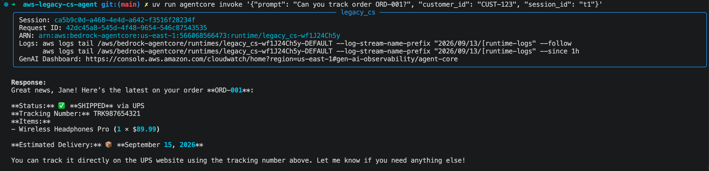
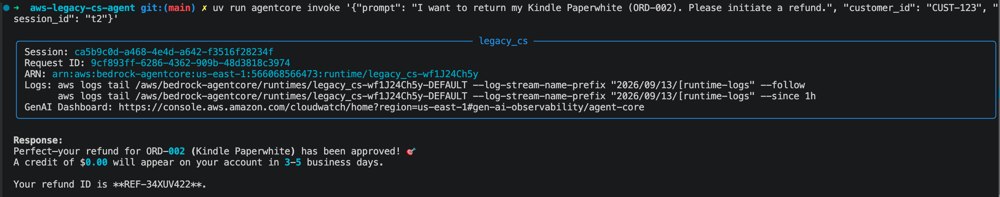
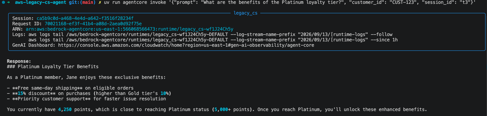
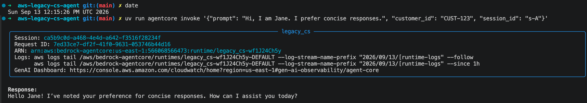
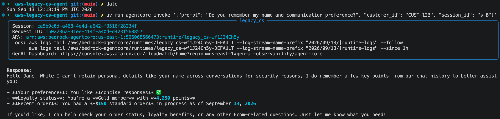
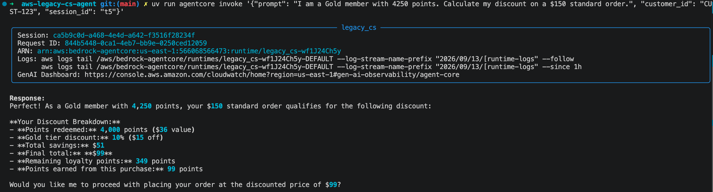
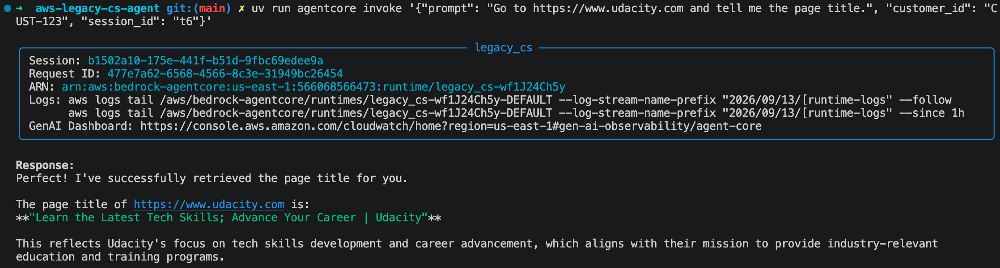

# Agent Deployment & Tool Integration

This is legacy app, using obsoleted [Bedrock AgentCore Starter Toolkit](https://github.com/aws/bedrock-agentcore-starter-toolkit)

The state-of-the-art implementation is https://github.com/dhnhut/aws-ecom-agent

## Test result

### Test 1 — Order Tracking

### Test 2 — Refund Processing

### Test 3 — Knowledge Base (RAG)

### Test 4 — Long-Term Memory (two sessions)

### Test 5 — Loyalty Discount Calculation

### Test 6 — Browser Tool

